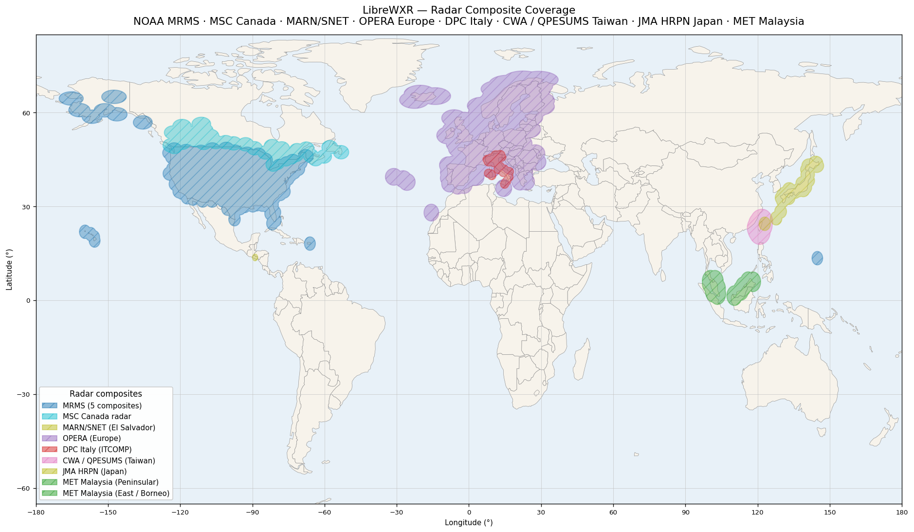
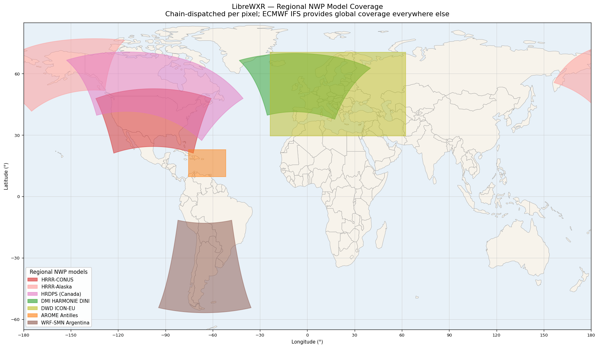

<p align="center">
  
</p>

# LibreWXR

A self-hostable, drop-in replacement for the [Rain Viewer](https://www.rainviewer.com/) API. LibreWXR serves weather radar tiles using freely available radar composite data from multiple sources, with full compatibility for any client built against the Rain Viewer v2 API.

## Why?

Rain Viewer recently (as of January 1st, 2026) restricted their free API tier: maximum zoom 7, single color scheme, no satellite, no forecast, PNG only. LibreWXR restores the full pre-restriction functionality as a self-hosted service.

Beyond this though, is the goal of creating a far more customizable API backend for self hosters. The ability to specify regions, radar styles, denoising levels, and more to come as well. With the goal being self-hosting, there are far greater possibilities for what can be both ingested and output via the API, and there is no need to offer any limitations on what is provided, aside from the technicality of the implementation of such features.

## Features

- **Rain Viewer v2 API compatible** — drop-in replacement, no client changes needed
- **All 10 color schemes** — Black & White, Rainviewer Original, Universal Blue, TITAN, TWC, Meteored, NEXRAD III, Rainbow, Dark Sky, Datameteo Valerio, plus raw grayscale
- **Tile sizes** — 256px and 512px
- **Image formats** — PNG and WebP (with configurable lossy/lossless quality)
- **Smoothing** — zoom-adaptive Gaussian blur with seamless tile boundaries
- **Multi-region coverage** — US (CONUS, Alaska, Hawaii, Puerto Rico, Guam) via NOAA MRMS quality-controlled mosaics with IEM fallback, Europe (OPERA pan-European composite, ~155 radars across 24 countries) with the DPC Italian national composite (24 radars) filling Italy where OPERA's neighbour-radar fringe falls short, Canada (MSC GeoMet with MRMS blending), Central America (MARN/SNET El Salvador, 120 km), Taiwan (CWA QPESUMS 7-radar composite, 1.4 km observed dBZ), Japan (JMA HRPN gauge-corrected QPE from 20 C-band radars + AMeDAS), and SE Asia (MET Malaysia 12-radar composite covering Peninsular Malaysia, Borneo, Brunei, Singapore, and N. Sumatra)
- **Regional NWP chain** — high-resolution rapid-refresh NWP models layered specificity-first: NOAA HRRR (CONUS + Alaska), ECCC HRDPS (Canada + N. CONUS), DMI HARMONIE-AROME DINI (most of populated Europe), DWD ICON-EU (the European remainder), JMA MSM (Japan + Korean Peninsula + Taiwan + Yellow Sea), SMN WRF-DET (Argentina + S. American Cone), and the full Météo-France AROME Outre-Mer family (Antilles, Guyane, Indien, Nouvelle-Calédonie, Polynésie), all on top of ECMWF IFS for global coverage. Soft-feathering at each domain edge prevents visible seams
- **Modular toggles** — every radar source, regional NWP, satellite channel, and the alerts feed has its own enable flag; master switches (`LIBREWXR_RADAR_ENABLED`, `LIBREWXR_REGIONAL_NWP_ENABLED`, `LIBREWXR_SATELLITE_ENABLED`) collapse whole layers in one line for satellite-only or nowcast-only deployments
- **ECMWF IFS global coverage** — ECMWF IFS 9 km precipitation data provides global precipitation animation and powers the nowcast everywhere the regional NWP chain doesn't reach. Multi-timestep animation auto-scales to match radar history length
- **Optical flow interpolation** — hourly ECMWF IFS frames are interpolated to 10-minute steps using dense motion vectors, so global IFS coverage animates smoothly like real radar data instead of jumping hour-to-hour (configurable, enabled by default)
- **Precipitation nowcasting (experimental)** — 60-minute short-range forecast by extrapolating recent radar forward using optical flow, with configurable blend mode: smooth radar-to-model blending (default), pure radar extrapolation (closest to Rain Viewer), or pure NWP forecast. The model side is taken from the active NWP chain — HRRR over CONUS, ICON-EU/DINI over Europe, WRF-SMN over the S. American Cone, JMA MSM over Japan + adjacent East Asia, IFS elsewhere. Beyond 60 minutes, always uses pure model. Quality varies by weather pattern — works best for steady, organized precipitation; less reliable for fast-developing convection
- **Precipitation motion arrows** — optional Dark Sky-style arrows showing storm movement direction and speed, derived from optical flow. Available for both radar and ECMWF data globally. Supports light and dark styles for different map themes via `?arrows=light` or `?arrows=dark` query parameter
- **Real satellite imagery (GMGSI composite)** — NOAA's hourly global mosaic (GOES-East + GOES-West + Meteosat-9 + Meteosat-10 + Himawari-9, composited by NESDIS) ingested as longwave IR + visible channels and rendered as a VIS-over-LW composite with a natural day/night terminator crossfade. Day side shows continents and clouds as they appear from space; night side shows cold-cloud IR on a transparent basemap. Up to 12 hours of hourly animation with persistent disk caching. Populates the Rain Viewer-compatible `satellite.infrared` endpoint
- **Weather alerts (WMO CAP)** — global weather alerts polled every 5 minutes from severeweather.wmo.int, with MeteoAlarm geocodes for European polygon resolution. Surfaced through a Rain Viewer-extension alerts API (`/v2/alerts/...`). Configurable via `LIBREWXR_ALERTS_ENABLED`
- **Snow detection** — per-pixel snow/rain classification. Regional NWP sources classify natively from their own 2-metre temperature field (HRRR-CONUS, HRRR-Alaska, WRF-SMN, DMI DINI, ICON-EU, JMA MSM); ECMWF IFS snowfall ratio fills everywhere else
- **Noise filtering** — configurable dBZ noise floor and speckle removal
- **Tile cache warming** — background pre-rendering for smooth animation playback
- **Multi-worker tile-server split** — optional production deployment splits the data pipeline from a pool of render workers that share state via memmap files. Lets every core actually do work instead of being GIL-bound at one. Pick the mode with `COMPOSE_PROFILES=multi` in `.env` (vs `single`)
- **Persistent disk cache** — radar / NWP / satellite / alerts data are cached to disk with atomic writes, surviving restarts and container recreation without re-downloading from upstream. Configurable via `LIBREWXR_CACHE_DIR` (required in multi mode)
- **Memory-efficient storage** — radar frames, NWP grids, satellite frames, and nowcast data are all backed by memory-mapped files, letting the OS page cache manage physical RAM instead of pinning data on the heap. Pages are reclaimed under memory pressure and re-faulted on access
- **Smart fetch optimization** — radar sources skip re-downloading frames already in memory (only ~1 of 12 frames is new each cycle), NWP models skip redundant S3 fetches when the model run hasn't changed, and parallel NWP fetches are concurrency-capped via `LIBREWXR_NWP_FETCH_CONCURRENCY` so peak transient RAM stays bounded
- **Health endpoint** — `/health` for monitoring uptime, per-component memory breakdown, frame count, NWP chain status, alerts status, and cache state
- **Fully configurable** — all tunable parameters exposed via environment variables

## Current Limitations

- **Limited radar coverage outside US / Canada / Europe / Central America / Taiwan / Japan / SE Asia** — real radar composites cover the US (CONUS, Alaska, Hawaii, Puerto Rico, Guam), Canada, El Salvador and its neighbours, Europe (via OPERA pan-European composite + DPC for Italy), Taiwan (CWA QPESUMS), Japan (JMA HRPN), and Malaysia + Borneo + Brunei + Singapore + N. Sumatra (MET Malaysia). Everywhere else uses the regional NWP chain on top of ECMWF IFS for the precipitation layer — that's a complete picture of global precipitation, but it's modelled output, not direct radar observation
- **Experimental nowcasting** — precipitation nowcast uses optical flow extrapolation blended with whichever regional model is active in the active NWP chain (or ECMWF IFS where none is), which works well for steady, organized precipitation but is less reliable for fast-developing convection, cell initiation/dissipation, or complex terrain effects
- **Satellite is hourly, not real-time** — GMGSI publishes one composite per hour with ~35 minutes of latency from observation. Native per-satellite feeds (GOES, Himawari, Meteosat) refresh every 5–15 minutes, but at the cost of seam-blending and reprojection work that GMGSI handles upstream. GMGSI also caps at ±72.7° latitude — the deep polar regions are out of frame

## Coverage

LibreWXR fuses native radar from regional networks across multiple
continents and layers a chain of high-resolution NWP models on top of
ECMWF IFS for global coverage.

**Radar composites:**



**Regional NWP models:**



Polygon shapes follow each grid's actual projected domain (LCC, polar
stereographic, LAEA, rotated lat/lon, or regular lat/lon) — not a
misleading lat/lon bounding box — so the curved edges visible on HRRR,
HRDPS, DMI DINI, OPERA, WRF-SMN, and JMA MSM are the real coverage
boundaries. See [`docs/coverage.md`](docs/coverage.md) for a labelled
breakdown of each polygon (resolution, projection, cycle cadence).
Regenerate both PNGs with
[`scripts/generate_coverage_map.py`](scripts/generate_coverage_map.py)
after adding or changing a radar source or NWP grid (the script header
documents the throwaway venv recipe).

### Radar regions

| Code | Region | Source | Resolution | RAM per frame |
|---|---|---|---|---|
| `USCOMP` | Continental US | NCEP MRMS (IEM fallback) | 0.005° (~500m) | ~63 MB |
| `AKCOMP` | Alaska | NCEP MRMS (IEM fallback) | 0.01° (~1km) | ~6 MB |
| `HICOMP` | Hawaii | NCEP MRMS (IEM fallback) | 0.005° (~500m) | ~3.4 MB |
| `PRCOMP` | Puerto Rico | NCEP MRMS (IEM fallback) | 0.01° (~1km) | ~1 MB |
| `GUCOMP` | Guam | NCEP MRMS (IEM fallback) | 0.0085° (~850m) | ~1 MB |
| `CACOMP` | Canada | MSC GeoMet (MRMS blending) | 0.025° (~2.5km) | ~6 MB |
| `SVCOMP` | El Salvador + neighbours | MARN/SNET (San Andrés, 120 km) | 0.00926° (~1km) | <1 MB |
| `OPERA` | Europe (24 countries) | EUMETNET OPERA | 1km | ~16 MB |
| `ITCOMP` | Italy + neighbours | DPC Radar (24-radar national composite) | ~1km (spherical TM) | ~3 MB |
| `TWCOMP` | Taiwan + W. Pacific buffer | CWA QPESUMS (7-radar composite) | 0.0125° (~1.4km) | ~3 MB |
| `JPCOMP` | Japan archipelago | JMA HRPN (20 radars + AMeDAS gauge correction) | 0.0125° (~1.4km) | ~4 MB |
| `MYPENINSULAR` | Peninsular Malaysia + Singapore + N. Sumatra | MET Malaysia (12-radar composite) | 0.022° lon / 0.019° lat (~2.5km) | <1 MB |
| `MYEAST` | East Malaysia (Borneo) + Brunei | MET Malaysia (12-radar composite) | 0.022° lon / 0.019° lat (~2.5km) | <1 MB |

Group aliases: `CONUS` (continental US only), `US` (all US regions), `CANADA` (Canada), `CENTRAL_AMERICA` (El Salvador + W. Honduras + S. Guatemala + offshore Pacific), `EUROPE` (OPERA pan-European composite + DPC for Italy), `SOUTHEAST_ASIA` (MET Malaysia peninsular + east composites — Peninsular Malaysia, Borneo, Brunei, Singapore, N. Sumatra), `TAIWAN` (CWA QPESUMS composite covering Taiwan + offshore Pacific), `JAPAN` (JMA HRPN composite covering the Japanese archipelago), `ALL` (everything).
You can also mix groups and individual regions: `CONUS,EUROPE,CANADA`.

Examples:
```bash
LIBREWXR_ENABLED_REGIONS=CONUS          # just continental US
LIBREWXR_ENABLED_REGIONS=US             # all US regions
LIBREWXR_ENABLED_REGIONS=EUROPE         # Europe only (OPERA composite)
LIBREWXR_ENABLED_REGIONS=CANADA         # Canada only
LIBREWXR_ENABLED_REGIONS=CONUS,EUROPE   # continental US + Europe
LIBREWXR_ENABLED_REGIONS=ALL            # everything available (default)
```

### Regional NWP chain

LibreWXR layers regional NWP models on top of the global IFS layer using
a **specificity-first chain**: at each pixel, the chain dispatches to
the narrowest model whose domain covers it, falling through to wider
models elsewhere. Soft feathering at every domain edge prevents visible
seams where domains meet.

| Region | Source | Resolution | Cycles | Toggle |
|---|---|---|---|---|
| Continental US | NOAA HRRR-CONUS | 3 km LCC | hourly | `LIBREWXR_NA_NWP_SOURCE=hrrr` |
| Alaska | NOAA HRRR-Alaska | 3 km polar stereo | 3-hourly | *(bundled with HRRR)* |
| Canada + N. fringe of CONUS | ECCC HRDPS-Continental | 2.5 km rotated lat/lon | 6-hourly | `LIBREWXR_HRDPS_ENABLED=true` |
| Most of populated Europe | DMI HARMONIE-AROME DINI | 2 km LCC | 3-hourly | `LIBREWXR_EU_NWP_PROFILE=dini_with_icon_eu` |
| European remainder | DWD ICON-EU | ~7 km | 3-hourly | `LIBREWXR_EU_NWP_PROFILE=icon_eu_only` *(or `dini_with_icon_eu`)* |
| Eastern Caribbean | Météo-France AROME Antilles | 2.5 km lat/lon | 4 cycles/day | `LIBREWXR_AROME_ANTILLES_ENABLED=true` |
| French Guiana + neighbours | Météo-France AROME Guyane | 2.5 km lat/lon | 4 cycles/day | `LIBREWXR_AROME_GUYANE_ENABLED=true` |
| SW Indian Ocean (Réunion, Mayotte, Madagascar) | Météo-France AROME Indien | 2.5 km lat/lon | 4 cycles/day | `LIBREWXR_AROME_INDIEN_ENABLED=true` |
| New Caledonia | Météo-France AROME Nouvelle-Calédonie | 2.5 km lat/lon | 4 cycles/day | `LIBREWXR_AROME_NCALED_ENABLED=true` |
| French Polynesia | Météo-France AROME Polynésie | 2.5 km lat/lon | 4 cycles/day | `LIBREWXR_AROME_POLYN_ENABLED=true` |
| South American Cone | SMN Argentina WRF-DET | 4 km LCC | 6-hourly | `LIBREWXR_WRF_SMN_ENABLED=true` |
| Japan + Korean Peninsula + Taiwan | JMA MSM (Mesoscale Model) | 5 km lat/lon | 3-hourly | `LIBREWXR_JMA_MSM_ENABLED=true` |
| Everywhere else | ECMWF IFS | 9 km global | 6-hourly | `LIBREWXR_ECMWF_ENABLED=true` |

Each model gets its own `LIBREWXR_*_PUBLISH_DELAY_MINUTES` and
`LIBREWXR_*_DBZ_OFFSET` for fine tuning — see `src/librewxr/config.py`
or [`docs/configuration-reference.md`](docs/configuration-reference.md)
for the full surface.

**Default recipe for broad global coverage:**

```bash
LIBREWXR_NA_NWP_SOURCE=hrrr               # CONUS + Alaska
LIBREWXR_HRDPS_ENABLED=true               # Canada
LIBREWXR_EU_NWP_PROFILE=dini_with_icon_eu # Europe (DINI + ICON-EU)
LIBREWXR_AROME_ANTILLES_ENABLED=true      # eastern Caribbean
LIBREWXR_AROME_GUYANE_ENABLED=true        # French Guiana
LIBREWXR_AROME_INDIEN_ENABLED=true        # SW Indian Ocean
LIBREWXR_AROME_NCALED_ENABLED=true        # New Caledonia
LIBREWXR_AROME_POLYN_ENABLED=true         # French Polynesia
LIBREWXR_WRF_SMN_ENABLED=true             # South American Cone
LIBREWXR_JMA_MSM_ENABLED=true             # Japan + Korean Peninsula + Taiwan
LIBREWXR_ECMWF_ENABLED=true               # global IFS layer (everywhere else)
```

The active chain is logged at startup as `NWP chain: [...]` and
surfaced under `/health` for verification.

## Quick Start

LibreWXR runs in either of two deployment modes — pick the one that
matches your hardware. See [Deployment](#deployment) for the full
comparison.

### Docker

A single `docker-compose.yml` covers both deployment shapes — pick which
one runs by setting `COMPOSE_PROFILES` in your `.env`:

| Mode | When to use | Set in `.env` |
|------|-------------|---------------|
| `single` | Laptops, small VPSes, home servers, anywhere a few GB of RAM is plenty. One process handles everything. | `COMPOSE_PROFILES=single` |
| `multi`  | Any deployment with 8+ cores and meaningful traffic. The data pipeline and N tile renderers run as separate containers sharing state via memmap files — bypasses the Python GIL so the whole rack can render in parallel. | `COMPOSE_PROFILES=multi` |

```bash
git clone https://github.com/JoshuaKimsey/LibreWXR.git
cd LibreWXR
cp .env.example .env
# Edit .env — pick COMPOSE_PROFILES=single or multi (default: single)
docker compose up -d
```

The app reads the same `COMPOSE_PROFILES` value to pick sensible
per-mode defaults for worker counts, cache sizes, thread pools, and
memory limits — so switching modes is a one-line edit. Multi-mode
defaults target an 80-core / 32 GB rack (16 render workers, 12 GB
pipeline cap, 18 GB render cap). Tune `LIBREWXR_WORKERS` and the
`LIBREWXR_PIPELINE_MEMORY` / `LIBREWXR_RENDER_MEMORY` env vars in
`.env` for smaller hardware.

### Manual

Requires Python 3.11+.

```bash
git clone https://github.com/JoshuaKimsey/LibreWXR.git
cd LibreWXR
python3 -m venv .venv
source .venv/bin/activate
pip install .
cp .env.example .env
# Edit .env to taste
python -m librewxr.main
```

The server starts at `http://localhost:8080` by default. It will fetch
radar data on startup (takes a few seconds), then begin serving tiles.

For multi mode without Docker, set `LIBREWXR_MODE=multi` (which picks
the right per-mode defaults), run the data pipeline as a sidecar, and
start the render workers with `LIBREWXR_RENDER_ONLY=1`:

```bash
export LIBREWXR_MODE=multi
export LIBREWXR_CACHE_DIR=/path/to/shared/cache    # required, shared

# Terminal 1 — data pipeline
python -m librewxr.data_pipeline

# Terminal 2 — tile-server worker pool
LIBREWXR_RENDER_ONLY=1 python -m librewxr.main
```

Both processes need the same `LIBREWXR_CACHE_DIR` pointed at a shared
directory.

### Auto-updating a Docker deployment

`scripts/auto-update.sh` is an optional helper for self-hosters running LibreWXR from a git checkout with `docker compose`. When run, it:

1. Fetches `origin` and checks whether the tracked branch has new commits.
2. If so, fast-forwards the working tree and runs `docker compose up -d --build` to rebuild and redeploy.
3. Otherwise exits quietly — it's safe to schedule via cron or a systemd timer.

The script is a **no-op by default** on any host. To opt in on a production host:

```bash
touch /path/to/LibreWXR/.auto-update-enabled
```

(Or export `LIBREWXR_AUTO_UPDATE=1` in the environment.) This sentinel is in `.gitignore`, so cloning the repo on a development machine will *not* accidentally enable auto-updates.

A typical cron entry for hourly updates:

```cron
0 * * * * /path/to/LibreWXR/scripts/auto-update.sh >> /var/log/librewxr-update.log 2>&1
```

Use `scripts/auto-update.sh --dry-run` to see what the script would do without making any changes; dry-run is always allowed regardless of the sentinel.

## Usage

### As a Rain Viewer replacement

Point any Rain Viewer-compatible client at your LibreWXR instance. The only change needed is replacing the Rain Viewer host URL with your LibreWXR URL.

For example, in JavaScript:

```javascript
// Before (Rain Viewer)
const apiUrl = "https://tilecache.rainviewer.com";

// After (LibreWXR)
const apiUrl = "http://localhost:8080";
```

### API Endpoints

#### Metadata

```
GET /public/weather-maps.json
```

Returns available radar timestamps and the host URL, matching Rain Viewer's response format:

```json
{
  "version": "2.0",
  "generated": 1773037528,
  "host": "http://localhost:8080",
  "radar": {
    "past": [
      {"time": 1773030600, "path": "/v2/radar/1773030600"},
      ...
    ],
    "nowcast": [
      {"time": 1773038400, "path": "/v2/radar/1773038400"},
      ...
    ],
    "colorSchemes": [
      {"id": 0, "name": "Black and White"},
      {"id": 7, "name": "Rainbow @ Selex SI"},
      ...
    ]
  },
  "satellite": {
    "infrared": [
      {"time": 1773030600, "path": "/v2/satellite/1773030600"},
      ...
    ]
  }
}
```

#### Radar Tiles

```
GET /v2/radar/{timestamp}/{size}/{z}/{x}/{y}/{color}/{smooth}_{snow}.{ext}
```

| Parameter | Values | Description |
|---|---|---|
| `timestamp` | Unix timestamp | From the metadata endpoint |
| `size` | `256`, `512` | Tile size in pixels |
| `z`, `x`, `y` | integers | Standard slippy map tile coordinates |
| `color` | `0`-`9`, `255` | Color scheme (see below) |
| `smooth` | `0`, `1` | Enable smoothing |
| `snow` | `0`, `1` | Enable snow precipitation colors |
| `ext` | `png`, `webp` | Image format |

**Optional query parameters:**

| Parameter | Values | Description |
|---|---|---|
| `arrows` | `light`, `dark` | Draw precipitation motion arrows (light for dark maps, dark for light maps) |

**Color schemes:**

| ID | Name |
|---|---|
| 0 | Black and White |
| 1 | Rainviewer Original |
| 2 | Universal Blue |
| 3 | TITAN |
| 4 | The Weather Channel |
| 5 | Meteored |
| 6 | NEXRAD Level III |
| 7 | Rainbow |
| 8 | Dark Sky |
| 9 | Datameteo Valerio |
| 255 | Raw (grayscale) |

#### Satellite Tiles

```
GET /v2/satellite/{timestamp}/{size}/{z}/{x}/{y}/0/0_0.{ext}
```

| Parameter | Values | Description |
|---|---|---|
| `timestamp` | Unix timestamp | From `satellite.infrared` in the metadata endpoint |
| `size` | `256`, `512` | Tile size in pixels |
| `z`, `x`, `y` | integers | Standard slippy map tile coordinates |
| `ext` | `png`, `webp` | Image format |

Returns real satellite imagery tiles backed by NOAA GMGSI. The endpoint serves a VIS-over-LW composite when both channels are loaded: the daytime side shows visible reflectance (continents, oceans, sunlit clouds) and the night side falls through to longwave IR (cold cloud tops on a transparent basemap). The terminator crossfade emerges naturally from the underlying reflectance field. Hourly cadence; global coverage between ±72.7° latitude.

#### Coverage Tiles

```
GET /v2/coverage/0/{size}/{z}/{x}/{y}/0/0_0.png
```

Returns tiles showing where radar data exists (white semi-transparent overlay).

#### Weather Alerts (LibreWXR extension)

```
GET /v2/alerts
GET /v2/alerts?lat={lat}&lon={lon}
GET /v2/alerts?bbox=west,south,east,north
```

Returns active weather alerts as a GeoJSON `FeatureCollection`, with
each feature carrying the alert polygon plus CAP metadata (severity,
urgency, certainty, event, headline, sender, expiry). Fed by WMO CAP
(global) and the NWS point endpoint (US locations, used to surface
non-polygon alerts like Tornado Watches).

| Query parameter | Description |
|---|---|
| *(none)* | All active alerts worldwide |
| `lat` + `lon` | Alerts whose polygon contains the point |
| `bbox=W,S,E,N` | Alerts whose polygon intersects the bounding box |
| `simplify` | Polygon simplification tolerance in meters (default 1000, `0` = full resolution) |

Returns `503` if `LIBREWXR_ALERTS_ENABLED=false`.

#### Health

```
GET /health
```

Returns server status, frame count, cache usage, NWP chain state, satellite cache state, alerts status, and per-component memory breakdown.

## Configuration

All settings are configured via environment variables (or a `.env` file). Copy `.env.example` to `.env` and adjust as needed. Every setting has a sensible default.

The table below covers the **commonly-tuned settings**. The full surface
(including per-source NWP publish delays, dBZ calibration offsets, and
source base URLs) lives in
[`docs/configuration-reference.md`](docs/configuration-reference.md) and
the inline comments in [`src/librewxr/config.py`](src/librewxr/config.py).

| Variable | Default | Description |
|---|---|---|
| **Server** | | |
| `LIBREWXR_PUBLIC_URL` | `http://localhost:8080` | Public URL for metadata responses |
| `LIBREWXR_PORT` | `8080` | Server listen port |
| `LIBREWXR_MAX_ZOOM` | `12` | Maximum tile zoom level |
| **Radar** | | |
| `LIBREWXR_RADAR_ENABLED` | `true` | Master switch for the entire radar layer (false = satellite-only deployment) |
| `LIBREWXR_ENABLED_REGIONS` | `ALL` | Radar region spec — see [Coverage](#radar-regions) for codes and groups |
| `LIBREWXR_NA_SOURCE` | `mrms_fallback` | US-side radar source: `mrms_fallback`, `mrms`, or `iem` |
| `LIBREWXR_CA_SOURCE` | `mrms_with_msc_blend` | Canada-side radar source: `mrms_with_msc_blend`, `mrms`, or `msc` |
| `LIBREWXR_MMD_ENABLED` | `true` | MET Malaysia 12-radar composite (Peninsular + Borneo + Brunei + Singapore + N. Sumatra) |
| `LIBREWXR_DPC_ENABLED` | `true` | DPC Italian national radar composite |
| `LIBREWXR_JMA_ENABLED` | `true` | JMA HRPN Japanese national radar composite |
| `LIBREWXR_FETCH_INTERVAL` | `600` | Seconds between radar data fetches (10 min, clock-aligned) |
| `LIBREWXR_MAX_FRAMES` | `12` | Radar frames in memory (2h at default 10-min cadence) |
| **Regional NWP chain** | | |
| `LIBREWXR_REGIONAL_NWP_ENABLED` | `true` | Master switch for every regional NWP source (false collapses the chain to IFS) |
| `LIBREWXR_NA_NWP_SOURCE` | `ifs` | `hrrr` to enable NOAA HRRR (CONUS + Alaska) |
| `LIBREWXR_EU_NWP_PROFILE` | `ifs` | `icon_eu_only` or `dini_with_icon_eu` to enable European NWP |
| `LIBREWXR_HRDPS_ENABLED` | `true` | ECCC HRDPS-Continental (Canada) |
| `LIBREWXR_AROME_ANTILLES_ENABLED` | `true` | Météo-France AROME Antilles (eastern Caribbean) |
| `LIBREWXR_AROME_GUYANE_ENABLED` | `true` | Météo-France AROME Guyane (French Guiana) |
| `LIBREWXR_AROME_INDIEN_ENABLED` | `true` | Météo-France AROME Indien (SW Indian Ocean — Réunion, Mayotte, Madagascar) |
| `LIBREWXR_AROME_NCALED_ENABLED` | `true` | Météo-France AROME Nouvelle-Calédonie |
| `LIBREWXR_AROME_POLYN_ENABLED` | `true` | Météo-France AROME Polynésie (French Polynesia) |
| `LIBREWXR_WRF_SMN_ENABLED` | `true` | SMN Argentina WRF-DET (South American Cone) |
| `LIBREWXR_JMA_MSM_ENABLED` | `true` | JMA Mesoscale Model (Japan + Korean Peninsula + Taiwan) |
| `LIBREWXR_ECMWF_ENABLED` | `true` | ECMWF IFS global precipitation (disable for regional-only debugging) |
| `LIBREWXR_NWP_FETCH_CONCURRENCY` | `4` | Max parallel NWP grid fetches per cycle |
| **Nowcast** | | |
| `LIBREWXR_NOWCAST_ENABLED` | `true` | Enable experimental precipitation nowcast |
| `LIBREWXR_NOWCAST_FRAMES` | `6` | Number of nowcast frames (6 × 10 min = 60 min forecast) |
| `LIBREWXR_NOWCAST_BLEND_MODE` | `blended` | `radar`, `blended`, or `model`. Beyond 60 min always uses pure model |
| **Satellite + alerts** | | |
| `LIBREWXR_SATELLITE_ENABLED` | `true` | Master switch for the GMGSI satellite layer (LW + VIS composite) |
| `LIBREWXR_GMGSI_LW_ENABLED` | `true` | GMGSI longwave IR channel (24/7 base of the composite) |
| `LIBREWXR_GMGSI_VIS_ENABLED` | `true` | GMGSI visible channel (daytime overlay) |
| `LIBREWXR_SATELLITE_MAX_FRAMES` | `12` | Hourly satellite frames per channel to keep (12 = 12 hours) |
| `LIBREWXR_ALERTS_ENABLED` | `true` | Enable WMO CAP weather alerts |
| `LIBREWXR_ALERTS_FETCH_INTERVAL` | `300` | Alerts refresh interval in seconds |
| **Tile rendering** | | |
| `LIBREWXR_TILE_CACHE_MB` | `200` | Max tile cache size in MB per worker (byte-capped) |
| `LIBREWXR_COORD_CACHE_SIZE` | `2048` | Coordinate cache entries per cache (lower = less RAM) |
| `LIBREWXR_SMOOTH_RADIUS` | `2.0` | Gaussian blur radius (0 = disabled) |
| `LIBREWXR_NOISE_FLOOR_DBZ` | `10.0` | Min dBZ to display (-32 = disabled) |
| `LIBREWXR_DESPECKLE_MIN_NEIGHBORS` | `3` | Speckle filter strength (0 = disabled) |
| `LIBREWXR_WEBP_QUALITY` | `65` | WebP quality (100 = lossless, <100 = lossy) |
| `LIBREWXR_WARMER_THREADS` | *mode* | Background tile warming threads per worker (single: 0 = CPU count - 1; multi: 4) |
| `LIBREWXR_WARM_COORD_ZOOM` | `6` | Pre-warm coordinate caches up to this zoom at startup (0 = disable) |
| `LIBREWXR_WARM_OVERVIEW_ZOOM` | `4` | Pre-render overview tiles up to this zoom after each fetch (-1 = disable) |
| **Deployment mode + workers** | | |
| `COMPOSE_PROFILES` | `single` | `single` or `multi` — picks compose services AND app-side per-mode defaults |
| `LIBREWXR_MODE` | *(from `COMPOSE_PROFILES`)* | Override mode when not using docker compose |
| `LIBREWXR_WORKERS` | *mode* | Uvicorn worker processes (single: 1; multi: 16) |
| `LIBREWXR_MEMORY_LIMIT_MB` | `0` | Memory limit in MB (0 = auto-detect from Docker/cgroup) |
| `LIBREWXR_CACHE_DIR` | *(empty)* | Persistent cache directory. **Required** in multi mode. Empty = in-memory only |
| **Multi-mode tile-server split** (set automatically by compose) | | |
| `LIBREWXR_RENDER_ONLY` | `false` | When `1`, skip fetcher / NWP / satellite init and only render tiles from the snapshot |
| `LIBREWXR_STATE_POLL_INTERVAL` | `1.0` | Seconds between state.json mtime polls in render-only mode |
| `LIBREWXR_STATE_WAIT_TIMEOUT` | `300` | Seconds to wait for the first state.json on cold start (0 = forever) |

See `.env.example` for detailed descriptions and tuning guidance for each setting.

## Deployment

LibreWXR supports two deployment modes — pick by setting
`COMPOSE_PROFILES` in `.env` (Docker) or `LIBREWXR_MODE` (manual).

### Single-container (personal / small-scale)

One process handles everything: fetching, nowcast generation, tile
rendering, and the HTTP server.

```
                       ┌────────────────────────────────────────┐
                       │   librewxr (one asyncio process)       │
[radar / NWP / sat /   │                                        │
 alerts upstreams]   ──┼──> [Fetchers + memmap stores]          ├──> tiles + API
                       │            │                           │
                       │            └──> [Tile Renderer +       │
                       │                  uvicorn HTTP server]  │
                       └────────────────────────────────────────┘
```

Best for laptops, small VPSes, home servers — anywhere a few GB of RAM
is plenty and you don't need to scale across cores. Run with:

```bash
docker compose up -d
```

### Multi-worker (production / multi-core)

The data pipeline and tile renderers run as separate containers,
sharing state via memmap files + a `state.json` snapshot on a shared
volume. The render side scales to N worker processes that each map the
same files, so 32 workers don't cost 32× the radar/NWP RAM — just the
per-worker tile cache and Python interpreter overhead.

```
┌────────────────────────────────────────┐    ┌────────────────────────────────────────┐
│   data-pipeline                        │    │   tile-server                          │
│   (one asyncio process)                │    │   (N uvicorn workers,                  │
│                                        │    │    LIBREWXR_RENDER_ONLY=1)             │
│   [radar / NWP / sat / alerts]  ──┐    │    │                                        │
│                                    │   │    │       ┌──> Worker 1 ─┐                 │
│   [Fetchers] ──> [Memmap stores +  │   │    │       ├──> Worker 2 ─┤                 │
│                   state.json       │   │    │       ├──> Worker 3 ─┼──> tiles + API  │
│                   snapshot]        │   │    │       ├──> ...      ─┤                 │
│                                    │   │    │       └──> Worker N ─┘                 │
└────────────────────────────────────────┘    │       (each polls state.json mtime and │
                  │                           │        re-loads stores on change)      │
                  │                           └────────────────────────────────────────┘
                  │                                            │
                  └──────────── shared volume (LIBREWXR_CACHE_DIR) ────────────┘
                                  (memmap files + state.json)
```

This is the right choice for any deployment with 8+ cores and meaningful
traffic — the single-process renderer gets GIL-bound at one core no
matter how many threads its pool has, but multi mode hands one core to
each render process. Production observation on an 80-core / 32 GB rack:
~16 GB total RSS, all cores active under load. Enable with:

```bash
# In .env
COMPOSE_PROFILES=multi

# Then:
docker compose up -d
```

### RAM requirements

**Single-container mode** — each worker process holds its own copy of
radar frames, NWP grids, coordinate caches, and tile caches. RAM usage
grows under real traffic as caches fill up.

| Configuration | Estimated RAM |
|---|---|
| CONUS + IFS only, 1 worker, 12 frames | ~3-4 GB |
| CONUS + HRRR + IFS, 1 worker, 12 frames | ~4-5 GB |
| ALL regions + IFS only, 1 worker, 12 frames | ~7-8 GB |
| ALL regions + full NWP chain, 1 worker, 12 frames | ~9-10 GB |
| ALL regions + full NWP chain, 2 workers, 12 frames | ~16-18 GB |

**Multi mode** shares the radar / NWP / satellite / alert state across
all render workers via memmap, so adding workers doesn't multiply the
data RAM — only the per-worker tile cache (default 128 MB in multi
mode) and Python interpreter overhead (~80 MB).

| Configuration | Pipeline RAM | Render RAM | Total |
|---|---|---|---|
| ALL regions + full NWP chain, 8 workers | ~8-10 GB | ~3-4 GB | ~12-14 GB |
| ALL regions + full NWP chain, 16 workers | ~8-10 GB | ~5-6 GB | ~14-16 GB |
| ALL regions + full NWP chain, 32 workers | ~8-10 GB | ~7-8 GB | ~16-18 GB |

Production observation on an 80-core / 32 GB rack (32 workers): ~16 GB
total RSS across both containers.

### Scaling

| Users | Mode | Workers | RAM (ALL regions + full NWP) |
|---|---|---|---|
| 1-5 (personal) | single | 1 | ~9-10 GB |
| 5-50 (small community) | single | 1-2 (with CDN) | ~9-18 GB |
| 50-500 (medium) | multi | 8-16 | ~12-16 GB |
| 500+ (large) | multi | 24-32+ (with CDN) | ~16-20 GB |

Tiles are served with `Cache-Control: public, max-age=300`, so any caching reverse proxy (nginx, Cloudflare, etc.) will work out of the box for high-traffic deployments. A CDN like Cloudflare (free tier works) absorbs most tile requests at the edge, meaning a single worker can serve far more users than the table above suggests. Using a Cloudflare Tunnel also provides free HTTPS with no certificate management. For most self-hosting scenarios, 1 worker behind Cloudflare is sufficient.

## Architecture

### Data flow

```
[MRMS / IEM]       ──┐
[MSC Canada]       ──┤
[MARN El Salvador] ──┤
[OPERA / DPC]      ──┼──> [Radar Frames (memmap)] ───┐
[CWA / JMA HRPN]   ──┤     (N frames, multi-region)  │
[MET Malaysia]     ──┘                                │
                                                      │
[HRRR / HRRR-AK]   ──┐                                ├──> [Nowcast Store (memmap)]
[HRDPS]            ──┤                                │     (radar extrap + NWP blend,
[DMI DINI]         ──┤   ┌─> [NWP Chain (memmap)] ───┤      6 frames / 60 min)
[ICON-EU]          ──┼───┤    (per-source feather +   │
[AROME-OM family]  ──┤   │     specificity-first      │
[WRF-SMN]          ──┤   │     blending)              ├──> [FastAPI + Tile Renderer]
[JMA MSM]          ──┤   │                            │      (LRU cache + tile warmer)
[ECMWF IFS]        ──┘   │                            │
                          │                            │
                          └─> [Optical Flow Interp] ───┤      [Satellite Tile Renderer]
                              (hourly → 10-min)        │       (VIS-over-LW composite)
                                                       │
[NOAA GMGSI S3] ─> [LW + VIS frames] ──> [Disk Cache] ─┤
   (hourly global mosaic)                (atomic writes)│
                                                       │
[WMO CAP] ───────> [Alert Store] ──────────────────────┘
   (severeweather.wmo.int + MeteoAlarm geocodes)
```

All stores are memmap-backed — the OS page cache manages physical RAM
and pages are reclaimed under pressure, so total resident set scales
with what's actually being touched, not with what's loaded.

### Adding a new source

Every radar composite and regional NWP grid lives as a self-contained
package under `src/librewxr/sources/` and is auto-discovered at startup.
Adding a new source means creating one directory; the discovery walker
handles registration, so `data/fetcher.py`, `data/regions.py`, and
`data/coverage.py` need no edits.

See [`docs/adding-a-source.md`](docs/adding-a-source.md) for the full
walkthrough — directory layout, provider function shapes, the
country-dir convention, station / range overrides, NWP priority
numbers, worked examples, and a final PR checklist.

## Data Sources

All sources are provided by government-funded institutions and are
freely available for any use. No external dependencies beyond pip — no
GDAL, rasterio, or system geo libraries needed.

### Radar

- **[NCEP MRMS](https://www.ncep.noaa.gov/products/mrms/)** — MultiSensor/3DReflectivity quality-controlled mosaics covering the US plus Canadian radar ingest. 2-min cadence; default source for North American regions. Falls back to IEM NEXRAD N0Q if MRMS is unavailable (`LIBREWXR_NA_SOURCE`).
- **[Iowa Environmental Mesonet (IEM)](https://mesonet.agron.iastate.edu/)** — NEXRAD N0Q composite radar imagery (US regions, legacy fallback for MRMS).
- **[ECCC MSC GeoMet](https://eccc-msc.github.io/open-data/msc-geomet/readme_en/)** — Canadian weather radar composite (RADAR_1KM_RRAI via WMS) — pre-colored PNG decoded via palette reverse-engineering back to dBZ. MRMS blending fills gaps in northern Canada and the Atlantic coast.
- **[MARN / SNET](https://www.snet.gob.sv/)** — Servicio Nacional de Estudios Territoriales (Ministerio de Medio Ambiente y Recursos Naturales, El Salvador), San Andrés 120 km radar product via anonymous Google Cloud Storage. 5-min cadence, covering all of El Salvador + western Honduras + southern Guatemala + offshore Pacific. Continuous HSV hue gradient decoded back to dBZ. Reproduced with attribution per MARN's open-data permission.
- **[EUMETNET OPERA](https://www.eumetnet.eu/activities/observations-programme/current-activities/opera/)** — Pan-European CIRRUS radar composite via [MeteoGate](https://meteogate.eu/) S3. ODIM HDF5, 3800×4400 at 1 km (LAEA), ~155 radars across 24 countries.
- **[DPC Radar (Italy)](https://radar-api.protezionecivile.it/)** — Dipartimento della Protezione Civile national VMI composite via the open Radar-DPC v2 REST API. Cloud-Optimized GeoTIFF, 1200×1400 at 1 km (spherical Transverse Mercator), 24 radars (11 DPC-direct + 13 partner), 5-min cadence. Wins precedence over OPERA wherever it covers, because Italy is not in the EUMETNET OPERA station list. Licensed under [CC-BY-SA 4.0](https://creativecommons.org/licenses/by-sa/4.0/) — attribution-share-alike (derivative tiles inherit the share-alike clause). Source: Dipartimento della Protezione Civile — Presidenza del Consiglio dei Ministri.
- **[CWA QPESUMS](https://www.cwa.gov.tw/)** — Central Weather Administration of Taiwan, 7-radar composite reflectivity product `O-A0059-001` via the `cwaopendata` AWS bucket. UTF-8 XML with raw dBZ at 1.4 km / 10-min cadence, covering Taiwan + a substantial western Pacific buffer for typhoon tracking. Filename timestamps are Taipei local time (UTC+8); data uses TWD67 datum (sub-pixel offset vs WGS84 at this resolution). Licensed under the [Open Government Data License v1.0](https://data.gov.tw/license) (資料來源：中央氣象署 / Source: Central Weather Administration, Taiwan).
- **[MET Malaysia](https://www.met.gov.my/)** — Jabatan Meteorologi Malaysia, 12-radar national composite (CAPPI 1 km, Rainbow 5 / LEONARDO Germany GmbH processing) via anonymous HTTPS at `api.met.gov.my`. 1352×570 animated GIF carrying 6 frames at 10-min cadence (~60 min of backfill per fetch), decoded via 18-stop palette → dBZ table. Split into `MYPENINSULAR` and `MYEAST` covering Peninsular Malaysia + N. Sumatra and East Malaysia (Borneo) + Brunei respectively. Singapore sits within `MYPENINSULAR`'s KLIA-radar coverage. Licensed under [CC-BY-4.0](https://creativecommons.org/licenses/by/4.0/) (Radar data © Jabatan Meteorologi Malaysia / METMalaysia).
- **[JMA HRPN](https://www.jma.go.jp/bosai/nowc/)** — Japan Meteorological Agency High-Resolution Precipitation Nowcast (気象庁ナウキャスト), 20 C-band Doppler radars + AMeDAS rain-gauge network composited as gauge-corrected QPE. Analysis leg only (radar composite); JPCOMP nowcast frames come from LibreWXR's internal optical-flow extrapolation blended with JMA MSM as the regional NWP overlay. Licensed under the [JMA Public Data License v1.0](https://www.jma.go.jp/jma/en/copyright.html) (CC-BY equivalent, commercial reuse permitted with attribution). Source: Japan Meteorological Agency website ([jma.go.jp](https://www.jma.go.jp/)).

### Regional NWP models

Layered ahead of IFS via specificity-first dispatch (see the [Regional NWP chain](#regional-nwp-chain) table for domain coverage and toggles).

- **NOAA HRRR-CONUS** — 3 km LCC, 15-min subh, hourly cycles. Anonymous AWS Open Data.
- **NOAA HRRR-Alaska** — 3 km polar stereographic, hourly wrfsfcf, 3-hourly cycles. Anonymous AWS Open Data.
- **ECCC HRDPS-Continental** — 2.5 km rotated lat/lon, 6-hourly cycles. Anonymous HTTPS via `dd.weather.gc.ca`.
- **DMI HARMONIE-AROME DINI** — 2 km native LCC, 3-hourly cycles. Anonymous AWS Open Data; covers most of populated Europe.
- **DWD ICON-EU** — ~7 km, 3-hourly cycles. DWD opendata; fills the European gaps DINI doesn't reach.
- **Météo-France AROME Outre-Mer family** — five regional grids sharing one Météo-France upstream (anonymous via OVH Object Storage, ~7 h publish delay), 2.5 km native lat/lon, 4 cycles/day:
  - **AROME Antilles** (priority 25) — Guadeloupe + Martinique + eastern Caribbean
  - **AROME Guyane** (priority 26) — French Guiana
  - **AROME Indien** (priority 27) — Réunion + Mayotte + Madagascar + Comoros (the largest of the AROME-OM grids)
  - **AROME Nouvelle-Calédonie** (priority 28) — New Caledonia
  - **AROME Polynésie** (priority 29) — French Polynesia
- **SMN Argentina WRF-DET** — 4 km LCC, 4 cycles/day. Anonymous AWS Open Data; covers the South American Cone.
- **[JMA MSM](https://www.jma.go.jp/jma/en/Activities/nwp.html)** via [Open-Meteo](https://open-meteo.com/) — Japan Meteorological Agency Mesoscale Model (5 km native, Japan + Korean Peninsula + Taiwan + Yellow Sea), republished by Open-Meteo to anonymous AWS Open Data. The regional NWP overlay paired with the JPCOMP radar composite — fills the model side of the nowcast blend with a Japanese mesoscale forecast instead of falling through to global IFS. Licensed [CC-BY-4.0](https://creativecommons.org/licenses/by/4.0/); data provided by Open-Meteo.com.

### Global precipitation

- **[ECMWF IFS](https://www.ecmwf.int/)** via [Open-Meteo](https://open-meteo.com/) — ECMWF IFS 9 km global precipitation and snowfall. Marshall-Palmer Z-R conversion with snow/rain classification from snowfall ratio. Hourly frames optical-flow-interpolated to 10-min steps. The global base layer for precipitation animation and nowcast extrapolation outside the regional NWP chain. Licensed [CC-BY-4.0](https://creativecommons.org/licenses/by/4.0/); data provided by Open-Meteo.com.

### Satellite

- **[NOAA GMGSI](https://registry.opendata.aws/noaa-gmgsi/)** — Global Mosaic of Geostationary Satellite Imagery, composited by NESDIS from GOES-East, GOES-West, Meteosat-9, Meteosat-10, and Himawari-9. Ingested as longwave IR + visible channels and rendered as a VIS-over-LW composite with natural day/night terminator. Anonymous AWS Open Data; hourly cadence; ±72.7° latitude coverage. Persistent disk cache survives restarts.

### Weather alerts

- **WMO CAP** at [severeweather.wmo.int](https://severeweather.wmo.int/) — global weather alerts with MeteoAlarm geocodes for European polygon resolution. Updates every 5 minutes; surfaced through a Rain Viewer-extension alerts API.

## Examples

The `examples/` directory contains two self-contained HTML files showcasing the full LibreWXR feature set:

- **`leaflet.html`** — Leaflet-based weather map
- **`maplibre.html`** — MapLibre GL JS-based weather map

Both examples include:
- **Source selector** — switch between local (`localhost:8080`) and the public instance (`api.librewxr.net`) with auto-detection
- **Layer modes** — Radar, Satellite, or Radar + Satellite (satellite as background under radar)
- **Light/dark theme** — toggles both the base map and UI styling
- **Color scheme selector** — all 10 color schemes
- **Motion arrows** — off, light, or dark
- **Scrubber bar** — draggable timeline with past/nowcast visual distinction and tick labels
- **Background preloading** — pre-renders all frames with a progress indicator for smooth animation
- **Keyboard shortcuts** — Space to play/pause, arrow keys to step through frames
- **Locate Me** — geolocate and zoom to your position
- **Auto-refresh** — metadata refreshes every 5 minutes to stay current

Open either file in a browser — it auto-detects whether to use your local server or the public instance based on how the file is loaded.

## License

LibreWXR is licensed under the [GNU Affero General Public License v3.0](LICENSE) (AGPL-3.0).
