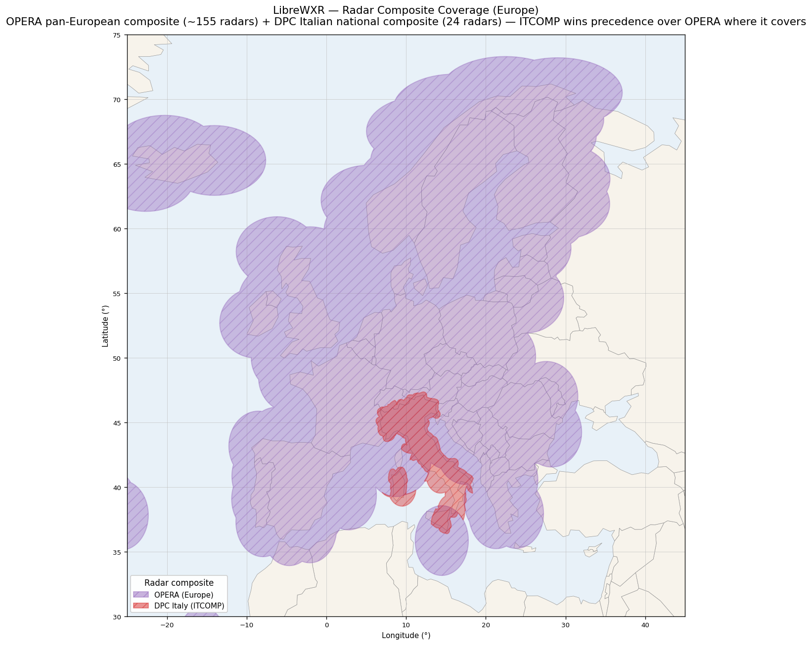
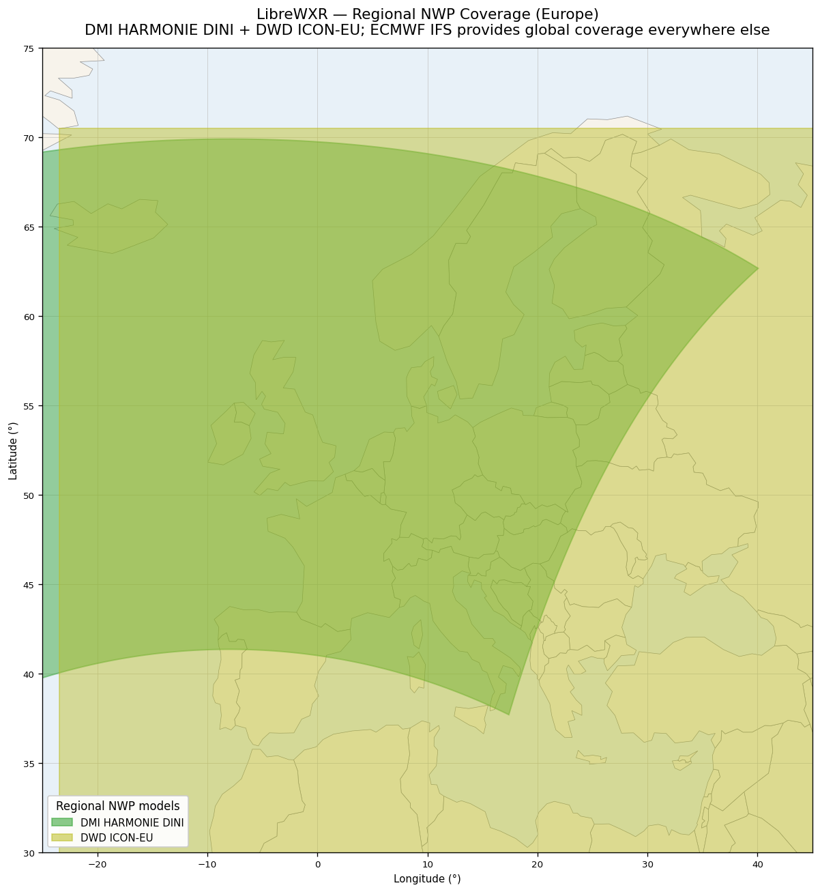
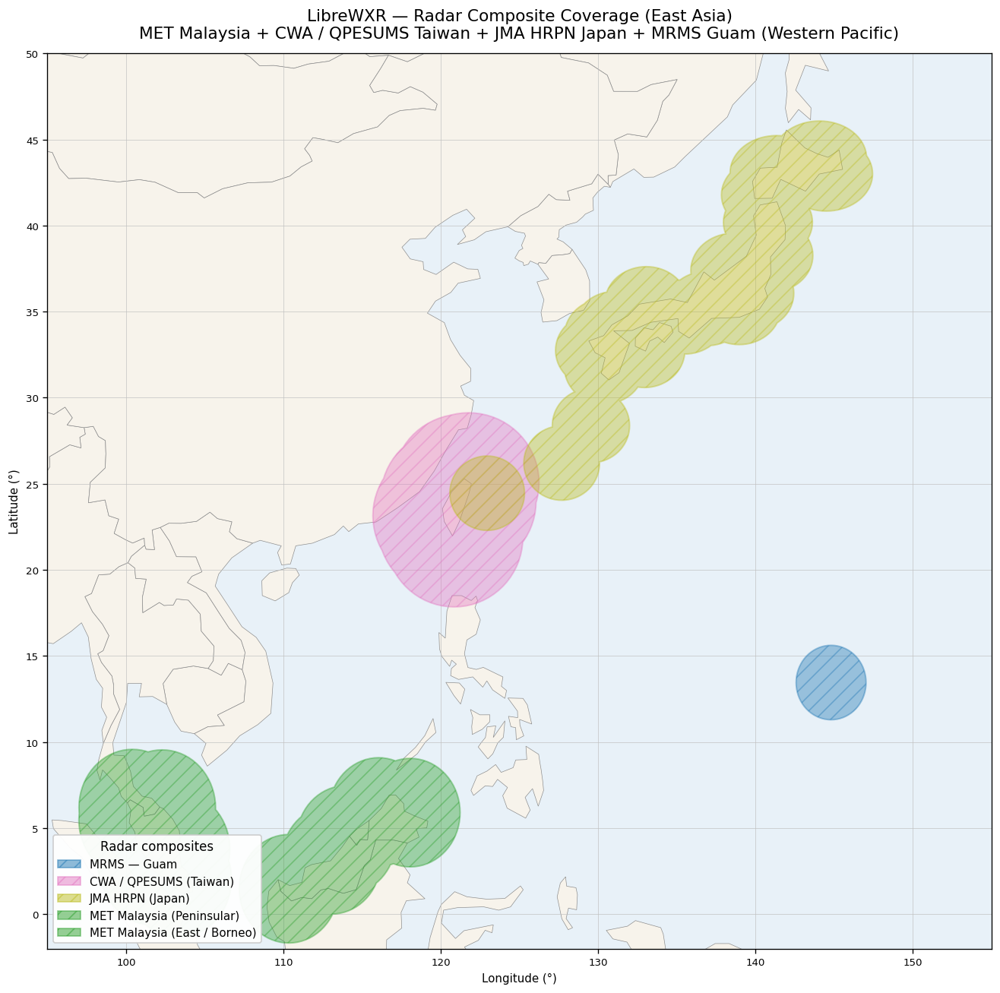
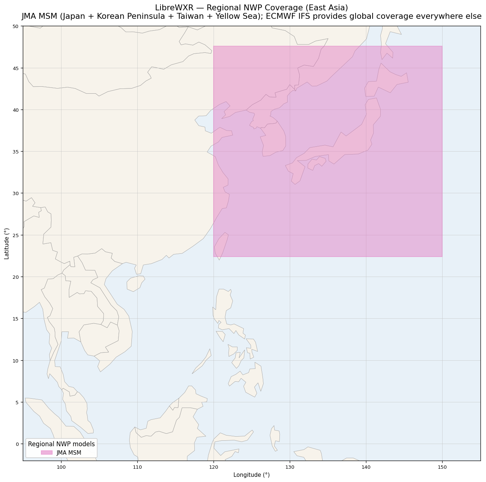

# LibreWXR — Coverage Maps

Visual reference for the radar composites and regional NWP grids
LibreWXR fuses into its tiles.

**ECMWF IFS is not drawn.** IFS provides 9 km global coverage as the
base of the NWP chain — it covers every pixel everywhere, so showing
it as a polygon would just paint the whole map. The two maps below
highlight where the regional chain wins over the global IFS layer.

Polygon shapes follow each grid's actual projected domain (LCC, polar
stereographic, LAEA, rotated lat/lon, or regular lat/lon) — not a
lat/lon bounding box — so the curved edges visible on HRRR, HRDPS,
DMI DINI, OPERA, and WRF-SMN are the real coverage boundaries the
fetcher and renderer respect.

---

## Radar composites


Polygons show the **union of effective coverage circles** around every
radar station in each network — 240 km per NEXRAD/ECCC station,
300 km per OPERA C-band station, matching the runtime coverage mask
in [`librewxr.data.coverage`](../src/librewxr/data/coverage.py). The
bumpy outlines reflect real radar coverage gaps (e.g. far northern
Canada, eastern Aleutians, the Mediterranean between Greece and Cyprus,
the Norwegian/Faroe gap above Iceland) rather than a lat/lon bounding
box that would have implied coverage where none exists.

| Source | Stations | Per-station range | Composite cadence | Composite resolution |
|---|---|---|---|---|
| NOAA MRMS — CONUS | NEXRAD WSR-88D (~160) | 240 km | 2 min | ~0.005° (~500 m) |
| NOAA MRMS — Alaska | NEXRAD WSR-88D (7) | 240 km | 2 min | ~0.01° |
| NOAA MRMS — Hawaii | NEXRAD WSR-88D (4) | 240 km | 2 min | ~0.005° |
| NOAA MRMS — Puerto Rico | NEXRAD WSR-88D (1) | 240 km | 2 min | ~0.01° |
| NOAA MRMS — Guam | NEXRAD WSR-88D (1) | 240 km | 2 min | ~0.0085° |
| ECCC MSC Canada | S-band dual-pol (32) | 240 km | 6 min | ~0.025° |
| EUMETNET OPERA | C-band (~155, 24 countries) | 300 km | 5 min | 1 km LAEA |
| DPC Italy (VMI) | C-band + X-band (24: 11 DPC + 13 partner) | 150 km | 5 min | 1 km tmerc |
| MARN El Salvador | S-band (1, San Andrés) | 120 km | 5 min | ~0.009° (~1 km) |
| CWA Taiwan QPESUMS | S/C-band (7) | 240 km | 10 min | ~0.0125° (~1.4 km) |
| MET Malaysia | S-band (12, national network) | 240 km | 10 min | ~0.022° lon / 0.019° lat (~2.5 km) |
| JMA HRPN (Japan) | C-band (20) + XRAIN X-band + AMeDAS gauges | 240 km | 5 min | ~0.0125° (~1.4 km) |

MRMS and MSC ingest each other's stations along the US/Canada border,
so the cross-border zone has overlap rather than a hard seam.

Italy is **not** in the EUMETNET OPERA station list. What OPERA shows
over Italian airspace is edge-of-range data from neighbouring radars
(France Côte d'Azur, Switzerland, Slovenia, southern Germany, Croatia,
Malta) — wide-beam, low-SNR, clutter-prone. The DPC Italian composite
runs alongside OPERA in the `EUROPE` group with finer `pixel_size`, so
the multi-region compositor lays ITCOMP down first wherever it covers
and OPERA fills the rest of Europe.

Japan's `JPCOMP` is a national QPE composite from JMA's HRPN product
(20 C-band Doppler radars fused with the AMeDAS gauge network).
Analysis-leg only — JMA also publishes a 60-minute forecast leg but
we don't currently ingest it; JPCOMP nowcast frames come from
LibreWXR's internal optical-flow extrapolation, blended with the
**JMA MSM** mesoscale NWP source over the same domain (see the
Regional NWP models section below).

---

## Regional NWP models


The NWP chain dispatches per pixel to the **narrowest** model whose
domain covers it, soft-feathering at every domain edge so seams don't
show. Anywhere none of these models reach, ECMWF IFS fills in.

| Source | Coverage | Resolution | Projection | Cycles |
|---|---|---|---|---|
| NOAA HRRR-CONUS | Continental US | 3 km | LCC | hourly |
| NOAA HRRR-Alaska | Alaska + adjacent Pacific | 3 km | polar stereographic | 3-hourly |
| ECCC HRDPS-Continental | Canada + northern US | 2.5 km | rotated lat/lon | 6-hourly |
| DMI HARMONIE-AROME DINI | Most of populated Europe + Iceland | 2 km | LCC | 3-hourly |
| DWD ICON-EU | Europe (wider than DINI) | ~7 km | regular lat/lon | 3-hourly |
| Météo-France AROME Antilles | Eastern Caribbean (Guadeloupe + Martinique) | 2.5 km | regular lat/lon | 6-hourly |
| Météo-France AROME Guyane | French Guiana | 2.5 km | regular lat/lon | 6-hourly |
| Météo-France AROME Indien | Réunion + Mayotte + Comoros + Madagascar + SW Indian Ocean | 2.5 km | regular lat/lon | 6-hourly |
| Météo-France AROME Nouvelle-Calédonie | New Caledonia + Vanuatu (SW Pacific) | 2.5 km | regular lat/lon | 6-hourly |
| Météo-France AROME Polynésie | French Polynesia (Society + Tuamotu + Marquesas archipelagoes) | 2.5 km | regular lat/lon | 6-hourly |
| SMN Argentina WRF-DET | South American Cone (AR/CL/UY/PY + S. Brazil + Bolivia) | 4 km | LCC | 6-hourly |
| JMA MSM | Japan + Korean Peninsula + Taiwan + Yellow Sea | 5 km | regular lat/lon | 3-hourly |

The HRRR-Alaska polygon wraps across the antimeridian onto the Russian
Far East — the polar-stereographic grid genuinely covers that area
because the central meridian sits at 135°W and the grid extends ~3,900
km eastward from it.

DMI DINI and ICON-EU both cover Europe; the chain picks DINI inside
its tighter domain and falls through to ICON-EU for the rest (then
IFS beyond ICON-EU). This is configurable via
[`LIBREWXR_EU_NWP_PROFILE`](configuration-reference.md#librewxr_eu_nwp_profile).

---

## Regional zooms

The global maps above pack every source into one frame; the per-region
zooms below let you read each network's detail without squinting.
They use a tighter window and a mid-latitude aspect correction so the
country shapes stay square at the visible scale.

### Europe

Radar — OPERA pan-European composite plus the DPC Italian national
composite filling Italy with native data:



Regional NWP — DMI HARMONIE DINI plus DWD ICON-EU:



### North America

Radar — NOAA MRMS (CONUS + Puerto Rico, with the eastern sliver of
Alaska clipping into the window) plus ECCC MSC Canada. Caribbean
radars (Cayman, Bermuda) are tracked in
[`docs/source-survey.md`](source-survey.md) as future additions:


Regional NWP — NOAA HRRR (CONUS + Alaska), ECCC HRDPS, plus the
Météo-France AROME Antilles + Guyane grids reaching into the Caribbean
fringe:


### East Asia

Radar — MET Malaysia (Peninsular Malaysia and East Malaysia / Borneo),
CWA / QPESUMS Taiwan, and JMA HRPN Japan, with MRMS Guam clipping in
from the Western Pacific:



Regional NWP — JMA MSM, the only regional model in the chain slot for
this part of the world. Covers Japan + the Korean Peninsula + Taiwan +
the Yellow Sea; ECMWF IFS provides the base layer for everything
outside the rectangle:



---

## Regenerating the maps

The PNGs are committed to the repository so they appear in the README
and on GitHub without any rendering pipeline. Regenerate them with
[`scripts/generate_coverage_map.py`](../scripts/generate_coverage_map.py)
after adding or changing a radar source or NWP grid. The script header
documents the throwaway-venv recipe; in short:

```bash
python3 -m venv /tmp/coverage-map-venv
/tmp/coverage-map-venv/bin/pip install matplotlib pyproj shapely
curl -L https://raw.githubusercontent.com/nvkelso/natural-earth-vector/master/geojson/ne_110m_admin_0_countries.geojson \
     -o /tmp/ne_countries.geojson
/tmp/coverage-map-venv/bin/python scripts/generate_coverage_map.py
```

The script walks each grid's perimeter in its native projection,
inverse-projects each edge sample to WGS84 lat/lon, and renders the
resulting polygon over a Natural Earth Vector 1:110m country basemap.
